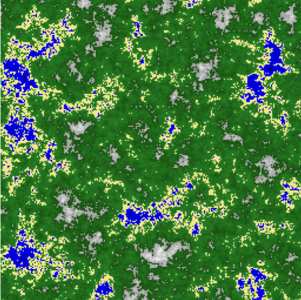
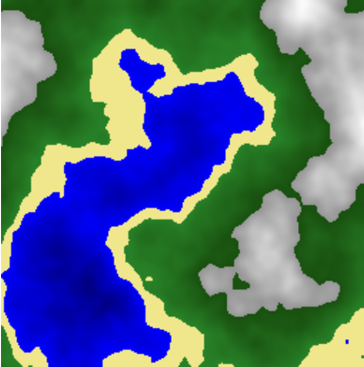
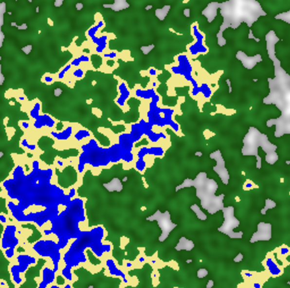
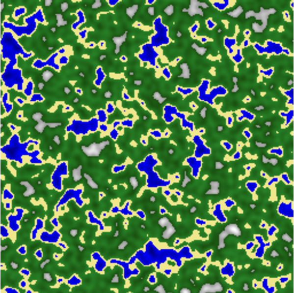

# Projet de Génération de Carte 2D 🌄  
**Générateur de terrain procédural en C utilisant le bruit de Perlin**  

---

## 📋 Description  
Ce projet génère des cartes d'altitude en utilisant des algorithmes de bruit procédural. Les cartes sont exportées au format PPM.  

---

## 🖼️ Captures d'Écran  

| Carte 1 | Lac |  
|-------------------|-------------------|  
|  |  |  

| Valée | Carte 2 |  
|--------|---------------|  
|  |  |  

---

## 🛠️ Fonctionnalités  
- Génération de heightmaps en 2D  
- Paramètres ajustables en temps réel  
- Export au format PPM (Portable Pixmap)  
- Palette de couleurs personnalisable  
- Algorithmes optimisés pour les performances  

---

## ⚙️ Paramètres de Génération  
```c
double echelle = 50.0;    // Contrôle le niveau de détail global  
int octaves = 7;          // Nombre de couches de bruit combinées  
double persistance = 0.8; // Influence des détails à haute fréquence  
```
---

## ⚙️ Installation & Utilisation  
1. **Prérequis** :  
   - Compilateur C
   - De quoi visualiser une image au format .ppm

2. **Exécution** :  

Rendez vous dans le dossier Setup et executer le fichier correspondant à votre OS.
